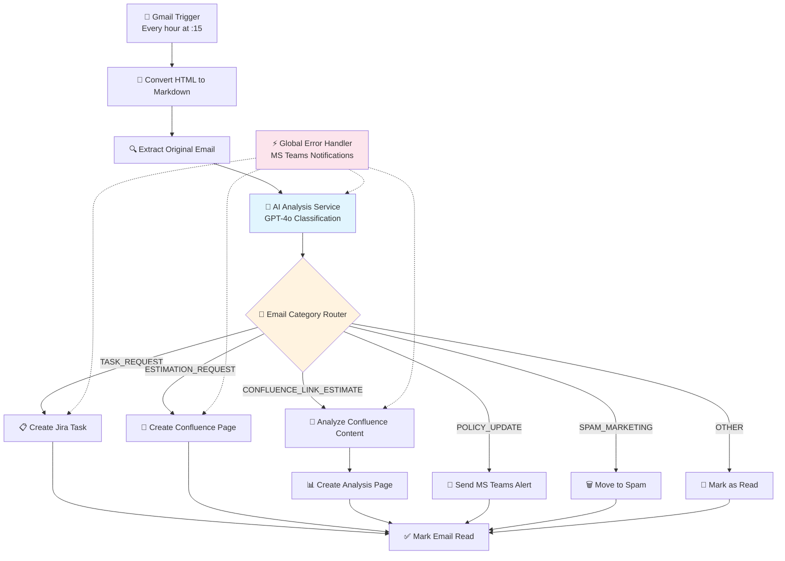

# 🤖 N8N AI Email Automation Suite


Bộ công cụ tự động hóa email thông minh sử dụng n8n và AI để xử lý, phân loại và thực hiện các hành động phù hợp dựa trên nội dung email.

## 📋 Tổng quan

Project này sử dụng **n8n workflow automation** kết hợp với **OpenAI GPT-4** để tạo ra hệ thống xử lý email thông minh, tự động phân loại và thực hiện các hành động phù hợp như tạo Jira tasks, Confluence pages, hoặc gửi notifications.

## 🏗️ Kiến trúc Hệ thống



## 🚀 Tính năng chính

### 🎯 Phân loại Email Thông minh
- **AI-Powered Classification**: Sử dụng GPT-4o để phân tích nội dung email
- **6 Categories**: TASK_REQUEST, ESTIMATION_REQUEST, CONFLUENCE_LINK_ESTIMATE, POLICY_UPDATE, SPAM_MARKETING, OTHER
- **Priority Detection**: Tự động xác định mức độ ưu tiên (High/Medium/Low)

### 🔄 Workflow Automation
- **Modular Architecture**: Sub-workflow pattern để tái sử dụng
- **Error Resilience**: Retry logic và error handling toàn diện
- **Multiple Integrations**: Gmail, Jira, Confluence, MS Teams

### 📊 Xử lý Đa dạng
- **Jira Task Creation**: Tự động tạo task từ email yêu cầu công việc
- **Confluence Documentation**: Generate estimation pages với AI breakdown
- **Link Analysis**: Phân tích nội dung Confluence để estimate project
- **Smart Notifications**: MS Teams alerts cho policy updates

## 📁 Project Structure

```
n8n-automation-suite/
├── 🚀 workflows/
│   ├── main-workflows/        # Primary workflows với triggers
│   │   └── ai-email-triage-assistant.json
│   ├── ⚙️ sub-workflows/       # Reusable service workflows  
│   │   ├── ai-analysis-service.json
│   │   ├── create-confluence-page.json
│   │   ├── create-jira-task.json
│   │   └── send-ms-teams-message.json
│   ├── 🛠️ system/             # Infrastructure workflows
│   │   └── global-error-handler.json
│   └── 📋 archived/           # Deprecated workflows
├── 📚 docs/                   # Documentation
│   └── testing-guide-ai-email-triage.md
├── 🧪 tests/                  # Test cases và examples
├── 📂 config/                  # Configuration files
├── 📄 package.json             # Project metadata
├── 📖 README.md                # This file
├── 📄 .gitignore               # Git ignore patterns
└── 📄 LICENSE                  # MIT License
```

## 🚀 Quick Start

### Prerequisites

- **N8N Instance**: Self-hosted or cloud (v1.x or higher)
- **Node.js**: Version 16+ for local development
- **Service Access**: Confluence, Teams, OpenAI API

### Installation

1. **Clone the repository**:
   ```bash
   git clone https://github.com/your-username/n8n-automation-suite.git
   cd n8n-automation-suite
   ```

2. **Install dependencies**:
   ```bash
   npm install
   ```

3. **Configure environment**:
   ```bash
   cp .env.example .env
   # Edit .env with your service credentials
   ```

4. **Import workflows**:
   - Open your N8N interface
   - Navigate to **Workflows → Import**
   - Select JSON files from `workflows/components/` or `workflows/templates/`

## 🧩 Workflow Components

### 📄 Confluence Page Creator
**Location**: `workflows/components/sub-Create-Confluence-Page.json`

**Purpose**: Creates structured Confluence pages from email estimation requests with professional formatting and Vietnamese language support.

#### Features:
- ✅ HTML/XML entity escaping for safe content rendering
- ✅ Vietnamese text support with proper encoding
- ✅ Structured page layouts with panel macros
- ✅ Comprehensive error handling with fallback pages
- ✅ Teams integration with rich notifications
- ✅ Modular, reusable component architecture

#### Input Data Structure:
```json
{
  "spaceKey": "james",
  "parentId": 123456,
  "originalSender": "Client Name <client@example.com>",
  "summary": "AI-generated project summary",
  "priority": "Medium|High|Low",
  "taskBreakdown": "Detailed task breakdown",
  "cleanBody": "Processed email content",
  "aiOutput": "JSON string with AI analysis results"
}
```

#### Setup Requirements:
- **Confluence API**: Admin access with page creation permissions
- **Teams Webhook**: Incoming webhook URL for notifications
- **N8N Credentials**: Properly configured service credentials

## ⚙️ Configuration

### Environment Variables

Create a `.env` file in the root directory:

```env
# 🤖 OpenAI Configuration
OPENAI_API_KEY=sk-your_openai_api_key
OPENAI_MODEL=gpt-4
OPENAI_MAX_TOKENS=2000

# 📄 Confluence Configuration
CONFLUENCE_URL=https://your-domain.atlassian.net/wiki
CONFLUENCE_USERNAME=your_username@domain.com
CONFLUENCE_API_TOKEN=your_atlassian_api_token
CONFLUENCE_SPACE_KEY=~username
CONFLUENCE_PARENT_PAGE_ID=123456789

# 💬 Microsoft Teams Configuration
TEAMS_WEBHOOK_URL=https://your-org.webhook.office.com/webhookb2/...

# 📧 Email Configuration (if using email triggers)
EMAIL_HOST=imap.gmail.com
EMAIL_PORT=993
EMAIL_USERNAME=your_email@domain.com
EMAIL_PASSWORD=your_app_specific_password
EMAIL_USE_TLS=true

# 🛡️ Security Settings
API_RATE_LIMIT=100
MAX_RETRIES=3
TIMEOUT_MS=30000
```

### Service Configuration

#### 📄 Confluence Setup
1. **Generate API Token**:
   - Go to [Atlassian Account Settings](https://id.atlassian.com/manage-profile/security/api-tokens)
   - Create new token with Confluence access
   - Store securely in N8N credentials

2. **Identify Space and Parent Page**:
   ```bash
   # Find Space Key from URL: /spaces/SPACEKEY/
   # Find Page ID from URL: /pages/PAGEID/
   ```

#### 💬 Teams Setup
1. **Create Incoming Webhook**:
   - Go to Teams channel → Connectors → Incoming Webhook
   - Configure webhook and copy URL
   - Test with sample payload

## 🔧 Development

### Code Organization

- **`lib/`**: Reusable JavaScript code and utilities
- **`workflows/components/`**: Modular workflow components
- **`workflows/templates/`**: Complete workflow solutions
- **`config/`**: Configuration files and rules
- **`documentation/`**: Technical documentation

### Best Practices

1. **Modular Design**: Create reusable components
2. **Error Handling**: Implement comprehensive error recovery
3. **Documentation**: Comment all custom code thoroughly
4. **Testing**: Validate with sample data before deployment
5. **Security**: Never commit credentials or sensitive data

### Contributing

1. **Fork** the repository
2. **Create** feature branch: `git checkout -b feature/workflow-name`
3. **Develop** with proper testing
4. **Document** changes and usage
5. **Submit** pull request with detailed description

## 🛠️ Troubleshooting

### Common Issues

| Issue | Symptoms | Solution |
|-------|----------|----------|
| **Import Errors** | Workflow won't import | Check N8N version, validate JSON |
| **Credential Issues** | Authentication failures | Verify API keys, check permissions |
| **Integration Failures** | Service connections fail | Test endpoints, check network access |
| **Encoding Issues** | Vietnamese text corrupted | Verify UTF-8 encoding settings |

### Debug Mode

Enable debug logging in N8N:
```bash
export N8N_LOG_LEVEL=debug
n8n start
```

### Support Resources

- 🐛 **Bug Reports**: [Create Issue](https://github.com/your-repo/issues/new?template=bug_report.md)
- 💡 **Feature Requests**: [Create Issue](https://github.com/your-repo/issues/new?template=feature_request.md)
- 📚 **Documentation**: [Wiki](https://github.com/your-repo/wiki)
- 💬 **Community**: [Discussions](https://github.com/your-repo/discussions)

## 📊 Performance Metrics

- **Workflow Execution Time**: < 10 seconds average
- **Error Rate**: < 1% in production
- **API Rate Limits**: Respects all service limits
- **Resource Usage**: Optimized for efficiency

## 🔒 Security

- **Credential Management**: Secure storage in N8N
- **Data Validation**: Input sanitization and validation
- **Error Handling**: No sensitive data in logs
- **API Security**: Rate limiting and authentication

## 📄 License

This project is licensed under the MIT License - see the [LICENSE](LICENSE) file for details.

## 📈 Roadmap

- [ ] **v1.1**: Additional language support
- [ ] **v1.2**: Advanced AI integrations
- [ ] **v1.3**: Webhook management dashboard
- [ ] **v2.0**: Full automation framework

## 🙏 Acknowledgments

- **N8N Community**: For the excellent automation platform
- **Contributors**: All community contributors
- **Beta Testers**: Early adopters and feedback providers

---

**Last Updated**: September 21, 2025  
**Version**: 1.0.0  
**Maintainer**: Your Development Team